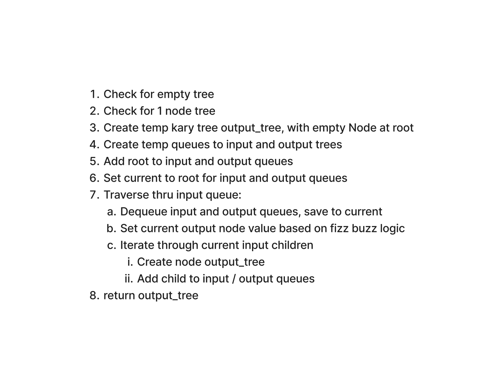

# Binary Tree - Fizz Buzz

Write a function called fizz buzz tree
- Arguments: k-ary tree
- Return: new k-ary tree

Determine whether or not the value of each node is divisible by 3, 5 or both. Create a new tree with the same structure as the original, but the values modified as follows:
- If the value is divisible by 3, replace the value with “Fizz”
- If the value is divisible by 5, replace the value with “Buzz”
- If the value is divisible by 3 and 5, replace the value with “FizzBuzz”
- If the value is not divisible by 3 or 5, simply turn the number into a String.

## Whiteboard Process

[Whiteboard link](https://www.figma.com/file/rNoFmdVDj9bb5K2c44ZIio/Code-Challenge-18?node-id=1%3A206&t=xJiNyBae4qfZxsnD-1)

## Approach & Efficiency

* Check for empty tree
* Check for 1 node tree
* Create temp kary tree output_tree, with empty Node at root
* Create temp queues to input and output trees
* Add root to input and output queues
* Set current to root for input and output queues
* Traverse thru input queue:
  * Dequeue input and output queues, save to current
  * Set current output node value based on fizz buzz logic
  * Iterate through current input children
  * Create node output_tree
  * Add child to input / output queues
* return output_tree

Time: O(n) because we need to traverse through every node

Space: O(n) because we need a temporary tree to hold all the data

## Solution

[Link to code](https://github.com/mikeshen7/data-structures-and-algorithms/blob/main/python/code_challenges/tree_fizz_buzz.py)

To run file, from python directory:

python -m code_challenges.tree_fizz_buzz

To test, from python directory:

pytest
