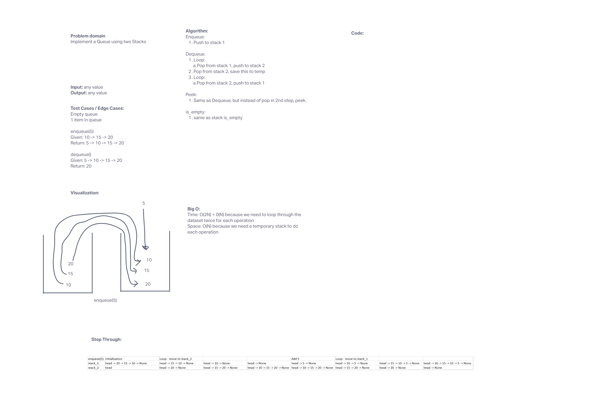

# Pseudo Queue
Create a new class called pseudo queue.

Do not use an existing Queue.

Instead, this PseudoQueue class will implement our standard queue interface (the two methods listed below),

Internally, utilize 2 Stack instances to create and manage the queue

## Whiteboard Process

[Whiteboard link](https://mikeshen926191.invisionapp.com/freehand/Code-Challenge-11-9QNVZuJsB?dsid_h=7d136b02c954f76cdba44d36e5de621bf4a26d8bec8877beb553a718b8bb5ed3&uid_h=cb08dec7ece6a9f52098e8b9edfd4330e40a53876f81c120382ecff9ccb5784d)

## Approach & Efficiency

Import in old Stack class.

Use 2nd stack to temporarily hold values to retrieve the front of queue / bottom of stack.

## Solution

[Link to code](https://github.com/mikeshen7/data-structures-and-algorithms/blob/main/python/code_challenges/stack_queue_pseudo.py)

To run file, from python directory:

python -m code_challenges.stack_queue_pseudo

To test, from python directory:

pytest

