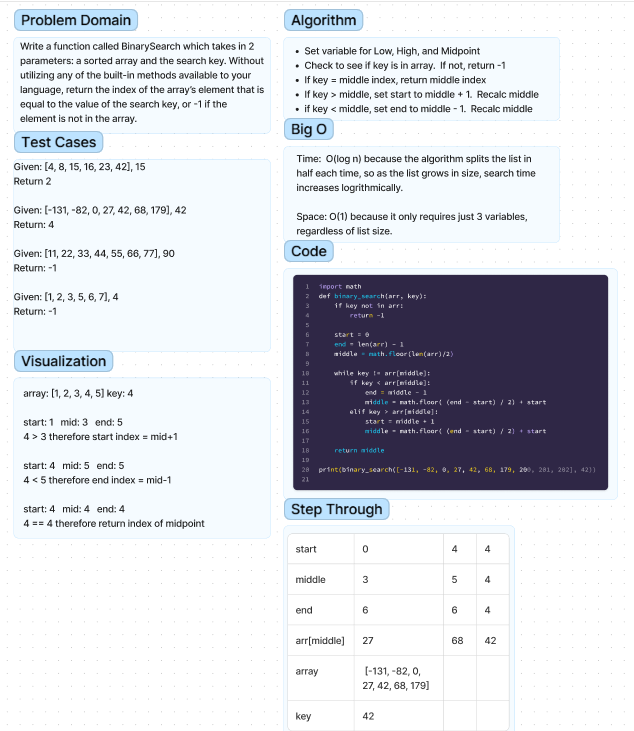

# Challenge Array Binary Search
Write a function called BinarySearch which takes in 2 parameters: a sorted array and the search key. Without utilizing any of the built-in methods available to your language, return the index of the array’s element that is equal to the value of the search key, or -1 if the element is not in the array.

## Whiteboard Process

[Whiteboard](https://www.figma.com/file/NK05UTml0uHWddBxnIieOs/Untitled?node-id=0-1&t=mv6dUeRomcqRRB7q-0)
Worked with Ethan Albers

## Approach & Efficiency
Split in half and check if above or below middle
Continue until you find the key
Time: O(log N) because we're always cutting the array in half so as the list gets bigger, time to search increased logrithmically
Space: O(1) because the space required is always just the size of the list + a few variables

## Solution
[Link to code]("https://github.com/mikeshen7/data-structures-and-algorithms/blob/main/python/code_challenges/array_binary_search/binary_search.py")

to run single instance: python binary_search.py
to run test: pytest
