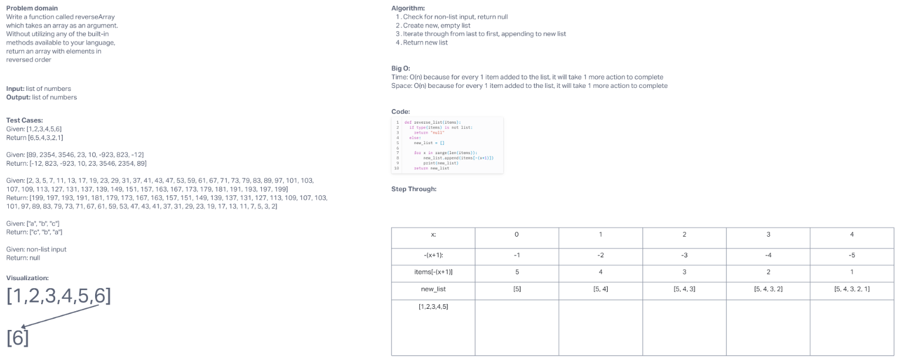

# Challenge Title
Write a function called reverseArray which takes an array as an argument. Without utilizing any of the built-in methods available to your language, return an array with elements in reversed order.

## Whiteboard Process

[Whiteboard](https://mikeshen926191.invisionapp.com/freehand/Code-Challenge-01-sv3HJUCTn?dsid_h=636e74e165c5531051b0873e4688b39f544ff7ad527c03572b07ffa9374a3fa2&uid_h=cb08dec7ece6a9f52098e8b9edfd4330e40a53876f81c120382ecff9ccb5784d)

## Approach & Efficiency
Used brute force to copy over all items from last to first.
O(n)

## Solution
[Link to code](https://github.com/mikeshen7/data-structures-and-algorithms/blob/main/python/code_challenges/array_reverse/array_reverse.py)
sample = ["car", "house", "boar"]
reverse_list(sample)
