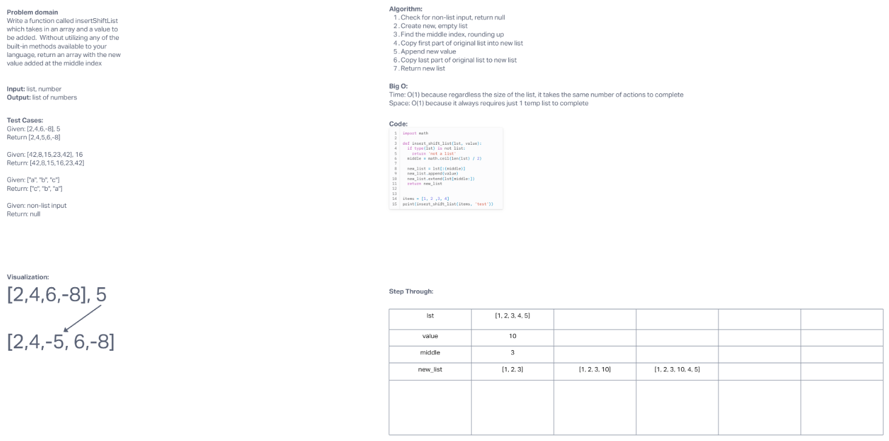

# Challenge Title
Write a function called insertShiftList  which takes in an array and a value to be added.  Without utilizing any of the built-in methods available to your language, return an array with the new value added at the middle index

## Whiteboard Process

[Whiteboard](https://mikeshen926191.invisionapp.com/freehand/Code-Challenge-02-tiQkRFLMt?dsid_h=1cdb2ceb96f1c100bb20530a6bf3fe66709620a89954d06d0ecb21ef03e1bc93&uid_h=cb08dec7ece6a9f52098e8b9edfd4330e40a53876f81c120382ecff9ccb5784d)

## Approach & Efficiency
Find the middle index, rounding up
Add first half to new list
Append new value
Extend 2nd half of old list to new list
Return new list

Time: O(1)
Space: O(1)

## Solution
[Link to code](https://github.com/mikeshen7/data-structures-and-algorithms/blob/main/python/code_challenges/insert_shift_list/insert_shift_list.py)
items = [1, 2 ,3, 4]
print(insert_shift_list(items, 10))
