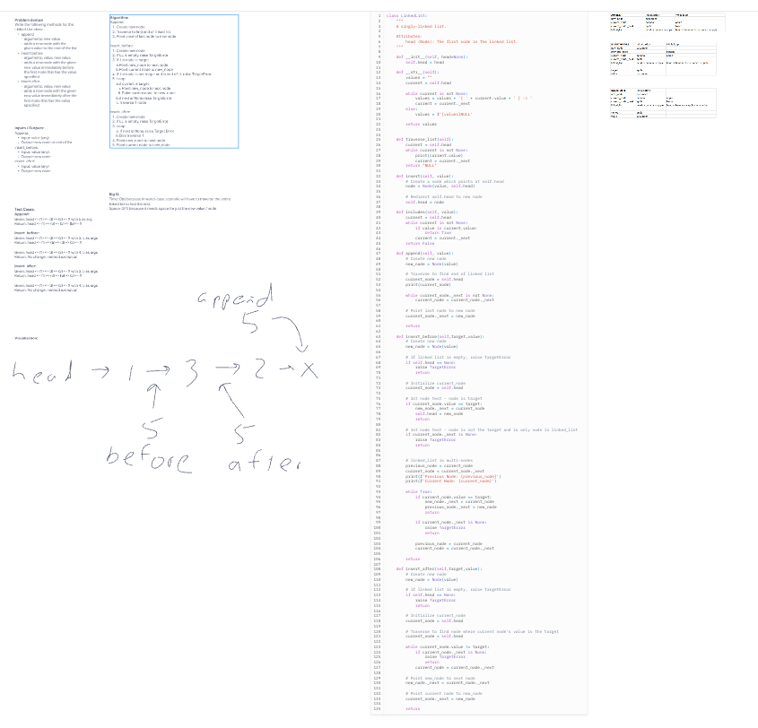

# Challenge Linked List
Create a Node class that has properties for the value stored in the Node, and a pointer to the next Node.
Methods:
1. insert.  Args: value, Return: none, adds new node with value to the head of the list with O(1) time
2. includes.  Args: value.  Returns boolean if value exists
3. to_string.  Args: none.  Returns string representing all values in the Linked List.  "{ a } -> { b } -> { c } -> NULL"
4. append.  Args: value.  Return: none, add new node to the end of the list
5. insert_before.  Arge: target, value.  Return: none.  Add new node before the node with the target value.
6. insert_after.  Arge: target, value.  Return: none.  Add new node after the node with the target value.

## Whiteboard Process

[Whiteboard link](https://mikeshen926191.invisionapp.com/freehand/Code-Challenge-06-HCrcyniQF?dsid_h=f1116fd29ee82ee38584af47d81e29895c9484bf575c108bd4377ab686fcf34b&uid_h=cb08dec7ece6a9f52098e8b9edfd4330e40a53876f81c120382ecff9ccb5784d)

## Approach & Efficiency
For traversing, use while loop.
Check to see if head is None.
Otherwise, set current to next head and loop.

Insert
Time: O(1) because it always takes one step to insert at the head
Space: O(n) because it takes the space of the new Node

__str__
Time: O(n) because you have to traverse the entire linked list
Space: O(1) because you're always just returning one string

append, insert_before, insert_after:
Time: O(n) because in worst-case scenario will have to traverse the entire linked list to find the end or target
Space: O(1) because it needs space for just the new value / node

## Solution
[Link to code](https://github.com/mikeshen7/data-structures-and-algorithms/blob/main/python/linked_list/linked_list.py)

Run from python folder:
to run single instance: python linked_list/linked_list.py
to run test: pytest
