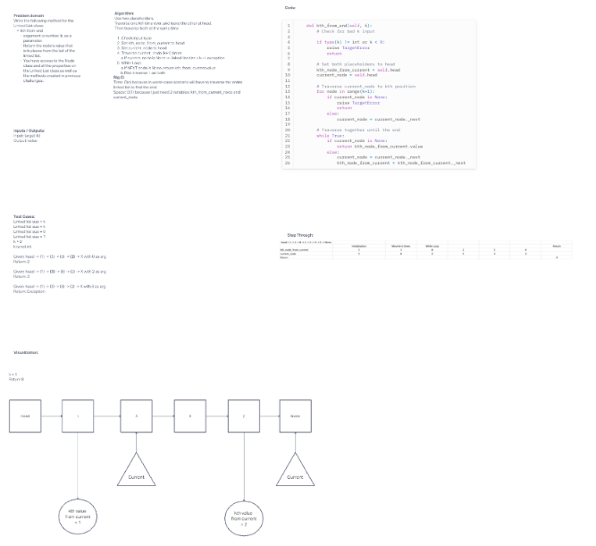

# Challenge Linked List - kth from end
Write the following method for the Linked List class:

kth from end

argument: a number, k, as a parameter.

Return the node’s value that is k places from the tail of the linked list.

You have access to the Node class and all the properties on the Linked List class as well as the methods created in previous challenges.

## Whiteboard Process

[Whiteboard link](https://mikeshen926191.invisionapp.com/freehand/Code-Challenge-07-xICsiMtEB?dsid_h=0409fac6aa1c64050f05c00c7b6fabbdf2cedd3bd26c8e2f424cf36cb97ed41b&uid_h=cb08dec7ece6a9f52098e8b9edfd4330e40a53876f81c120382ecff9ccb5784d)

## Approach & Efficiency
Use two placeholders.
Traverse one kth time over, and leave the other at head.
Then traverse both at the same time

Time: O(n) because we always have to traverse to the end, but we can do both placeholders together

Space: O(1) because I just need two variables: kth_from_current_node and current_node

## Solution
[Link to code](https://github.com/mikeshen7/data-structures-and-algorithms/blob/main/python/linked_list/linked_list.py)

Run from python folder:

to run single instance: python linked_list/linked_list.py

to run test: pytest
