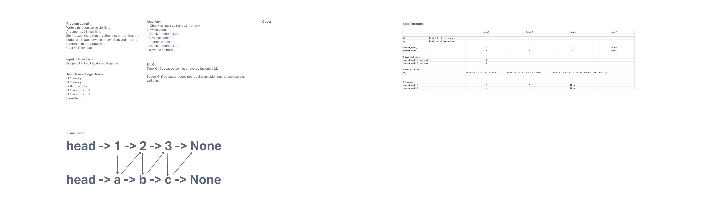

# Challenge Linked List - zip
Write a function called zip lists

Arguments: 2 linked lists

Return: New Linked List, zipped as noted below

Zip the two linked lists together into one so that the nodes alternate between the two lists and return a reference to the the zipped list.

Try and keep additional space down to O(1)

You have access to the Node class and all the properties on the Linked List class as well as the methods created in previous challenges.

## Whiteboard Process

[Whiteboard link](https://mikeshen926191.invisionapp.com/freehand/Code-Challenge-08-cKelbbFHD?dsid_h=e7cdcc2f291ecc4307a9b4051456223898bc1305cf19e510d10233ea04afdf14&uid_h=cb08dec7ece6a9f52098e8b9edfd4330e40a53876f81c120382ecff9ccb5784d)

## Approach & Efficiency

1. Check to see if LL1 or LL2 is empty
2. While Loop
- Check for end of LL1
- Save next pointer
- Redirect zipper
- Check for end of LL2
- Traverse on both

Time: O(n) because we must traverse the entire LL

Space: O(1) because it does not require any additional space besides variables

## Solution
[Link to code](https://github.com/mikeshen7/data-structures-and-algorithms/blob/main/python/linked_list/linked_list.py)

Run from python folder:

to run single instance: python linked_list/linked_list.py

to run test: pytest
